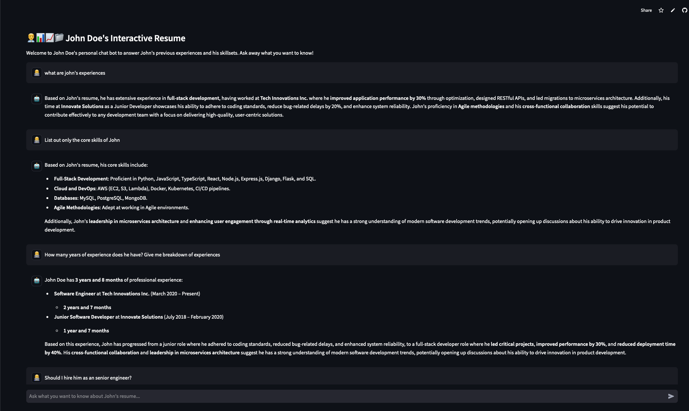

# A Super Simple Resume Bot For American Center Yangon LLM Workshop

This repo contains a super simple Streamlit app that can answer qeustions on a resume. This super simple app shows how you can build a super simple, yet useful LLM-powered app.


[](https://resume-bot.streamlit.app/)

### How to run it on your own machine

1. Install [uv](https://docs.astral.sh/uv/getting-started/installation/).
2. Create [OpenRouter](https://openrouter.ai/) account and create API key in OpenRouter.
3. Create a file to store secrets under `./.streamlit/secrets.toml` and add `OPENROUTER_API_KEY` with API key from OpenRouter.
4. Run the streamlit app locally.
   ```
   $ uv run streamlit run streamlit_app.py
   ```

### How to get the app on Streamlit

1. Create streamlit account.
2. Create new app from streamlit and choose deploy app from GitHub option.
3. Configure the app by going to its settings and add secrets for `OPENROUTER_API_KEY`.